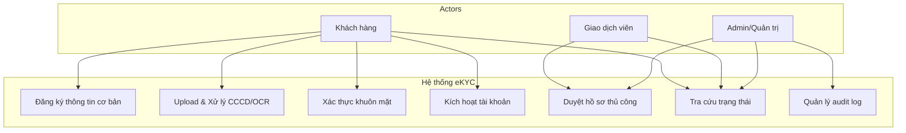
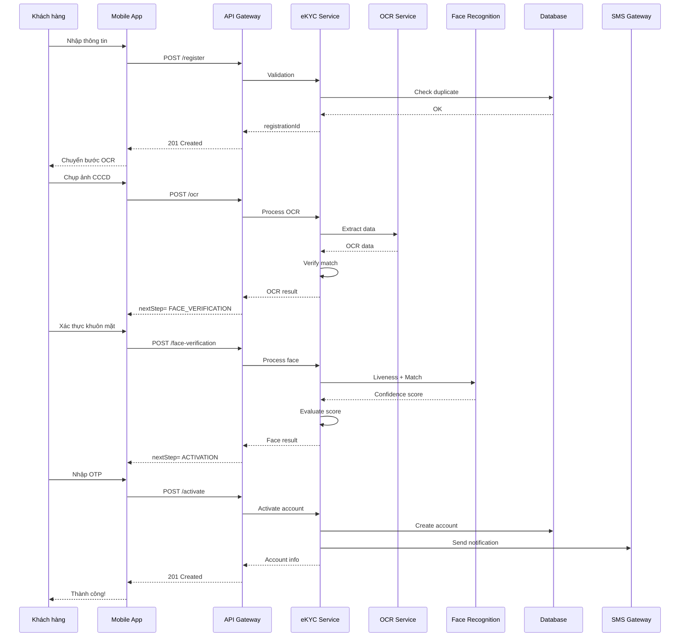
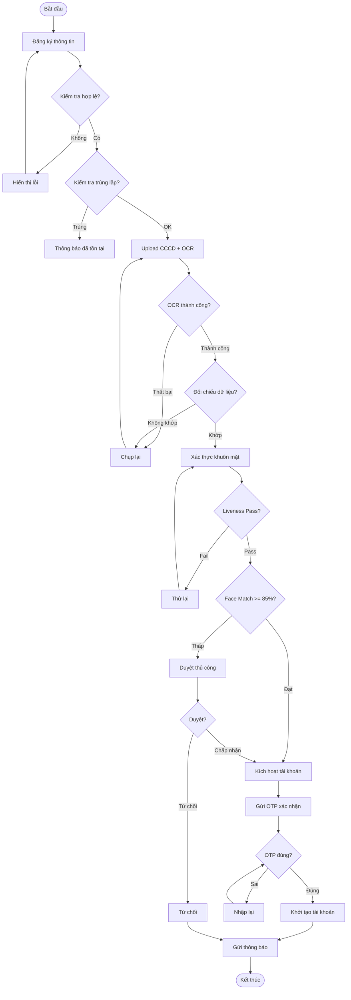
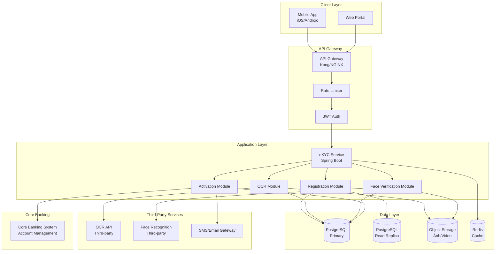

# SOFTWARE REQUIREMENTS SPECIFICATION (SRS)
## Hệ thống eKYC - Ngân hàng số ABC Bank
### Phiên bản: 1.0 | Ngày: 01/07/2026

---

## Phần 1: Introduction

### 1.1 Purpose
Tài liệu này mô tả chi tiết các yêu cầu chức năng và phi chức năng cho hệ thống **eKYC (Electronic Know Your Customer)** của Ngân hàng số ABC Bank. Tài liệu nhằm mục đích làm cơ sở cho đội ngũ Development và QA triển khai xây dựng và kiểm thử hệ thống.

### 1.2 Scope
Hệ thống eKYC cho phép khách hàng mở tài khoản ngân hàng hoàn toàn trực tuyến thông qua quy trình: đăng ký thông tin → xác thực giấy tờ (OCR) → xác thực khuôn mặt (Liveness + Face Matching) → kích hoạt tài khoản. Hệ thống hướng tới mục tiêu "Zero manual operation" - tự động hóa tối đa, giảm thiểu can thiệp của giao dịch viên.

### 1.3 Definitions & Acronyms

| Thuật ngữ | Định nghĩa |
|-----------|------------|
| **eKYC** | Electronic Know Your Customer - Quy trình xác thực khách hàng điện tử |
| **OCR** | Optical Character Recognition - Nhận dạng ký tự quang học |
| **CCCD** | Căn cước công dân (giấy tờ tùy thân tại Việt Nam) |
| **CMND** | Chứng minh nhân dân |
| **Liveness Detection** | Kỹ thuật phát hiện khuôn mặt thật, chống giả mạo bằng ảnh/video |
| **Face Matching** | So khớp khuôn mặt từ ảnh chụp trực tiếp với ảnh trên giấy tờ |
| **AML** | Anti-Money Laundering - Chống rửa tiền |
| **KYC** | Know Your Customer - Xác thực khách hàng |
| **SMS OTP** | One-Time Password gửi qua tin nhắn |

### 1.4 References
- Nghị định 52/2013/NĐ-CP về Thương mại điện tử
- Thông tư 23/2019/TT-NHNN về hoạt động thanh toán không dùng tiền mặt
- PCI DSS Security Standards

### 1.5 Overview
Tài liệu gồm 5 phần: (1) Giới thiệu, (2) Mô tả tổng quan, (3) Yêu cầu chức năng chi tiết, (4) Yêu cầu phi chức năng, (5) Sơ đồ trực quan.

---

## Phần 2: Overall Description

### 2.1 Product Perspective
Hệ thống eKYC là một module trong hệ sinh thái Ngân hàng số ABC Bank, kết nối với:
- **Mobile App**: Giao diện người dùng
- **Core Banking System**: Xử lý tài khoản gốc
- **OCR Service**: Xử lý nhận dạng giấy tờ (third-party)
- **Face Recognition Service**: Xử lý nhận dạng khuôn mặt (third-party)
- **SMS/Email Gateway**: Gửi thông báo

### 2.2 Product Functions
- Đăng ký thông tin khách hàng
- Upload và xử lý ảnh CCCD/CMND (OCR)
- Xác thực khuôn mặt (Liveness Detection + Face Matching)
- Đối chiếu dữ liệu tự động
- Sinh số tài khoản và kích hoạt
- Xử lý ngoại lệ và duyệt thủ công

### 2.3 User Classes

| User Class | Đặc điểm | Yêu cầu |
|------------|----------|---------|
| **Khách hàng cá nhân** | Người dùng phổ thông, tuổi 18+, có smartphone | Giao diện đơn giản, thao tác nhanh |
| **Giao dịch viên** | Nhân viên ngân hàng, xử lý ngoại lệ | Dashboard quản lý hồ sơ chờ duyệt |
| **Admin** | Quản trị hệ thống | Giám sát, audit log, cấu hình |

### 2.4 Operating Environment
- **Mobile**: iOS 14+, Android 8+
- **Backend**: Java 17+, Spring Boot 3.x
- **Database**: PostgreSQL 15+
- **Third-party**: OCR API, Face Recognition API
- **Cloud**: AWS/GCP với Auto-scaling

### 2.5 Constraints
- Tuân thủ Nghị định 52/2013/NĐ-CP và các quy định của NHNN
- Dữ liệu cá nhân phải được mã hóa (AES-256) khi lưu trữ
- Thời gian lưu trữ hồ sơ tối thiểu 5 năm
- API chỉ hỗ trợ JSON format

### 2.6 Assumptions and Dependencies
- Khách hàng có smartphone và kết nối Internet ổn định
- Dịch vụ OCR/Face Recognition sẵn sàng 99.9%
- Core Banking API có sẵn các endpoint cần thiết

---

## Phần 3: Specific Functional Requirements

### 3.1 Module Đăng ký thông tin cơ bản

#### 3.1.1 Mô tả
Cho phép khách hàng nhập thông tin cá nhân để khởi tạo yêu cầu mở tài khoản.

#### 3.1.2 API Specifications

**Endpoint: POST /api/v1/ekyc/register**

| Field | Type | Required | Validation | Business Rule |
|-------|------|----------|------------|---------------|
| fullName | String | Yes | 2-100 ký tự, không chứa số/ký tự đặc biệt | Tên phải có ít nhất 2 từ |
| phone | String | Yes | SĐT Việt Nam 10 số (đầu 03, 05, 07, 08, 09) | Không trùng với SĐT đã đăng ký |
| email | String | Yes | Chuẩn email, tối đa 100 ký tự | Không trùng email đã đăng ký |
| citizenId | String | Yes | Đúng 12 số, theo chuẩn CCCD | Không trùng CCCD đã đăng ký |

**Response Success (201):**
```json
{
  "registrationId": "uuid",
  "message": "Đăng ký thông tin thành công",
  "nextStep": "OCR_VERIFICATION"
}
```

**Response Error (400):**
```json
{
  "status": 400,
  "error": "VALIDATION_ERROR",
  "message": "Dữ liệu không hợp lệ",
  "details": {
    "phone": "Số điện thoại đã tồn tại trong hệ thống",
    "citizenId": "CCCD phải gồm đúng 12 chữ số"
  }
}
```

#### 3.1.3 Acceptance Criteria
- [x] Tất cả trường bắt buộc đều được validate
- [x] Kiểm tra trùng lặp với database
- [x] Trả về registrationId để tiếp tục flow
- [x] Lưu trạng thái PENDING_REGISTRATION

### 3.2 Module OCR/Xử lý CCCD

#### 3.2.1 API Specifications

**Endpoint: POST /api/v1/ekyc/ocr**
**Endpoint: POST /api/v1/ekyc/ocr/verify**

| Field | Type | Required | Description |
|-------|------|----------|-------------|
| registrationId | String | Yes | ID từ bước đăng ký |
| frontImage | File | Yes | Ảnh mặt trước CCCD (JPG/PNG, max 10MB) |
| backImage | File | Yes | Ảnh mặt sau CCCD (JPG/PNG, max 10MB) |

**Response Success (200):**
```json
{
  "registrationId": "uuid",
  "ocrStatus": "COMPLETED",
  "extractedData": {
    "citizenId": "001202012345",
    "fullName": "NGUYEN VAN A",
    "dob": "01/01/2000",
    "gender": "NAM",
    "address": "Ha Noi"
  },
  "matchScore": 95.5,
  "nextStep": "FACE_VERIFICATION"
}
```

#### 3.2.2 Acceptance Criteria
- [x] Kiểm tra chất lượng ảnh trước khi OCR
- [x] OCR trích xuất tối thiểu 6 trường dữ liệu
- [x] Đối chiếu dữ liệu OCR với dữ liệu đăng ký
- [x] Điểm match >= 90% mới cho phép tiếp tục

### 3.3 Module Xác thực khuôn mặt

#### 3.3.1 API Specifications

**Endpoint: POST /api/v1/ekyc/face-verification**

| Field | Type | Required | Description |
|-------|------|----------|-------------|
| registrationId | String | Yes | ID từ bước đăng ký |
| faceVideo | File | Yes | Video ngắn 3-5 giây (MP4, max 20MB) |
| faceImage | File | Yes | Ảnh chân dung (JPG/PNG, max 5MB) |

**Response Success (200):**
```json
{
  "registrationId": "uuid",
  "livenessStatus": "PASSED",
  "confidenceScore": 92.3,
  "faceMatchScore": 88.7,
  "overallStatus": "APPROVED",
  "nextStep": "ACCOUNT_ACTIVATION"
}
```

#### 3.3.2 Acceptance Criteria
- [x] Liveness Detection chống lại: ảnh chụp màn hình, video quay lại, mặt nạ
- [x] Face Matching confidence >= 85%
- [x] Thời gian xử lý < 10 giây
- [x] Tự động chụp 3 ảnh trong quá trình liveness check

### 3.4 Module Kích hoạt tài khoản

#### 3.4.1 API Specifications

**Endpoint: POST /api/v1/ekyc/activate**

| Field | Type | Required | Description |
|-------|------|----------|-------------|
| registrationId | String | Yes | ID từ bước đăng ký |
| otpCode | String | Yes | Mã OTP xác nhận (6 số, qua SMS) |

**Response Success (201):**
```json
{
  "accountId": "ACC20260701001",
  "accountNumber": "1900123456789",
  "status": "ACTIVE",
  "message": "Chúc mừng bạn đã mở tài khoản thành công!"
}
```

#### 3.4.2 Business Rules nhúng
- Số tài khoản: 13 số, prefix 190 + mã ngân hàng + số ngẫu nhiên
- Nếu tất cả bước đều PASSED → ACTIVE ngay
- Nếu có bước WARNING → PENDING (chờ duyệt thủ công)
- OTP có hiệu lực 5 phút

---

## Phần 4: Non-Functional Requirements

### 4.1 Security (Bảo mật)
| Yêu cầu | Mô tả | Tiêu chuẩn |
|---------|-------|-------------|
| **NFR-SEC-01** | Mã hóa dữ liệu nhạy cảm (CCCD, ảnh khuôn mặt) | AES-256 |
| **NFR-SEC-02** | Truyền tải qua HTTPS/TLS 1.3 | TLS 1.3 |
| **NFR-SEC-03** | Xác thực API bằng JWT Bearer Token | OAuth2 |
| **NFR-SEC-04** | Rate Limiting chống Brute Force | 10 requests/phút/IP |
| **NFR-SEC-05** | Audit Log cho mọi thao tác quan trọng | Bất biến (immutable) |

### 4.2 Performance (Hiệu năng)
| Chỉ tiêu | Target | Method |
|----------|--------|--------|
| API Response Time (P95) | < 500ms | JMeter/K6 |
| OCR Processing Time | < 5s/image | Internal benchmark |
| Face Match Processing | < 10s | Internal benchmark |
| Concurrent Users | 1000+ | Load test |

### 4.3 Availability (Tính sẵn sàng)
- Uptime: 99.9% (downtime tối đa 8.7 giờ/năm)
- Backup hàng ngày, point-in-time recovery
- Multi-AZ deployment

### 4.4 Scalability
- Horizontal scaling: thêm instance khi traffic > 70%
- Database read replicas
- CDN cho static assets (ảnh CCCD, video)

### 4.5 Compliance
- Tuân thủ Nghị định 13/2023/NĐ-CP về bảo vệ dữ liệu cá nhân
- Lưu trữ log 5 năm
- Cơ chế xóa dữ liệu theo yêu cầu (Right to erasure - GDPR-like)

---

## Phần 5: Visual Diagrams

### 5.1 Use Case Diagram



### 5.2 Sequence Diagram - Luồng đăng ký eKYC



### 5.3 Activity Diagram - Quy trình xử lý



### 5.4 Component Diagram - Kiến trúc hệ thống



---

## Phụ lục: API Endpoint Summary

| Module | Method | Endpoint | Mô tả |
|--------|--------|----------|-------|
| Registration | POST | /api/v1/ekyc/register | Đăng ký thông tin |
| Registration | GET | /api/v1/ekyc/status/{id} | Tra cứu trạng thái |
| OCR | POST | /api/v1/ekyc/ocr | Upload & xử lý CCCD |
| OCR | POST | /api/v1/ekyc/ocr/verify | Xác nhận dữ liệu OCR |
| Face | POST | /api/v1/ekyc/face-verification | Xác thực khuôn mặt |
| Activation | POST | /api/v1/ekyc/activate | Kích hoạt tài khoản |
| Activation | POST | /api/v1/ekyc/resend-otp | Gửi lại OTP |
| Admin | GET | /api/v1/admin/ekyc/pending | Danh sách chờ duyệt |
| Admin | PUT | /api/v1/admin/ekyc/review/{id} | Duyệt hồ sơ |

---

*Tài liệu được tạo theo chuẩn IEEE 830-1998*
*Dự án: Hệ thống eKYC - Ngân hàng số ABC Bank*
